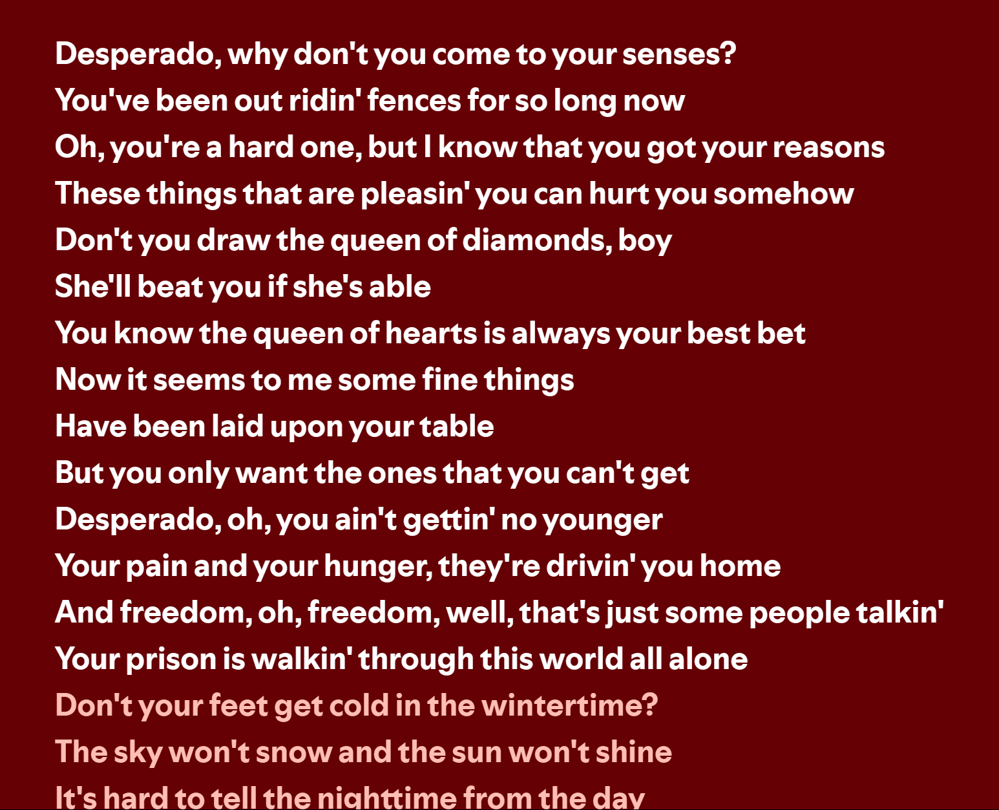

## A Farewell to Chapel Hill

在教堂山难忘的一年就要结束了。去年8月来美之前，我幻想美国是我终究会实现梦想的地方。我抱着雄心壮志和对新环境未知的惴惴不安来到这片森林中，并未预想自己会在这里生存一年之久。如今秋去冬来、春天近乎末尾之际，骤觉时间似乎又快又慢，我已经要离开了。

An unforgettable year in Chapel Hill is drawing to an end. Before I came to the U.S. last August, I fantasized about America as the place where I would ultimately realize my dreams. With great ambition and a nervous curiosity toward the unknown, I stepped into this forested land—not quite expecting I would survive here for an entire year. Now, with autumn gone, winter passed, and spring nearly at its close, time feels both fast and slow—and I am about to leave.

虽然无数次吐槽此地没有好吃的，且不断自我标榜为大城市里长大的孩子所以不习惯森林中的生活，但真在收拾行李的时候，还是对这里依依不舍。在这间屋子里住了八个月整，再怎么也有了些感情；每一个小物件都是我从或熟悉或陌生的某处寻来填充这间孤独的房间，以寻求一些慰藉的，但如今要么扔进垃圾箱，要么硬塞进我能带回国的23+23+10kg的行李之中。明天此时，这间屋子大概就会像没有人来住过的样子了。

Though I’ve complained countless times about the lack of good food and repeatedly claimed that, having grown up in a big city, I could never quite adapt to life in the woods, I still feel a pang of reluctance as I pack my bags. I’ve lived in this room for eight full months—surely, I’ve grown attached to it. Every little object in the room was something I brought here, whether from familiar places or strange ones, to fill the solitude of this space and to seek some small comfort. And now, all these things must either go into the trash or be forced into the 23 + 23 + 10 kilograms of luggage I can bring back home. By this time tomorrow, this room will likely look as if no one had ever lived in it.

突然回忆起许多在这里的记忆。我必须承认，在这里的很多时光都在孤独、焦虑、失眠和茫然中度过；但当如今只剩回忆时，竟能一瞬间想起的都是一些难忘的或美好的小事。去年，我在这个书桌前熬夜完成了我的第一篇学术论文的初稿，我满心得意地在今年的ESS上报告了它，但今天白天我依然还在改着这个项目的代码，抓耳挠腮地思考；这或许能够说明我在一年之内成长了不少，已经瞧不起自己之前的思路了。遥想自己曾以为半年左右能将它结束，如今已经一年多了，竟然还烂在手里，只好苦笑一阵了。仔细想来，自己大多数的预先安排其实都没有完成，或者进度比预想的慢得多，不免有些自责和焦虑。但此刻我竟也觉得这些都是难忘的经历了。

Suddenly, memories flood back. I must admit, much of my time here was spent in loneliness, anxiety, insomnia, and confusion. Yet now, with only memories left, it’s the beautiful and unforgettable moments that come rushing back. Last year, at this very desk, I stayed up all night writing the first draft of my first academic paper. I was so proud to present it at ESS this year—though, even earlier today, I was still debugging the code for the same project, scratching my head over it. Perhaps that’s a sign of growth: I’ve outgrown the way I once thought. I had imagined the project would be done in half a year, but here I am, over a year later, and it’s still hanging unfinished. I can only laugh at myself. Looking back, most of my plans didn’t go as expected, or the progress was far slower than I had hoped. There is some guilt and anxiety about that—but now, it all feels like a cherished part of the journey.

多亏鼓励着我陪伴着我的人吧。我何其幸运能在这里遇见这么多善良、和蔼、愿意帮助晚辈的老师、学长学姐们。如今回想，当时刚刚踏上这片土地的心高气傲的我是多么天真，不知天高地厚——我很惭愧我一直有着一种由自卑而生出的自尊心，也因此在一些事情上带有令人讨厌的傲气，不过我在这里还是大胆承认了吧。这份不愿意比不过任何人的好胜心一直驱使着我接受新的东西，而不是骄傲自满；但更重要的还是自己的每一步付出都有人肯定。Guang和Arne是我最想感谢的人。Guang总是在为我想着能做一篇关于什么的文章，让后续在美国拿到位置更有胜算，于是我几乎每个月都会去找他聊两次天，每次都长达一个多小时。Arne则一直肯定着我，并不会因为自己的学术成就而看不起本科生的想法。我做的network analysis其实他并不懂，但他总能很耐心听我讲完，也尊重我想要做的东西和每一次天马行空的想法，并且很认真地给我提着建议。我由衷希望如果有一天，我能拥有和他们一样的成就，我也要成为他们这样的人。

I owe it to the people who encouraged and supported me. How lucky I am to have met so many kind, generous, and supportive mentors and peers here. Looking back, I see how naïve I was when I first stepped on this land, full of pride and blind ambition. I am ashamed of the arrogance I carried, born from an insecure pride, which sometimes made me disagreeable. But here, let me confess it openly. This competitiveness, born from not wanting to lose to anyone, has driven me to learn and grow rather than become complacent. But more importantly, my efforts have always been recognized by someone. Guang and Arne are the people I want to thank the most. Guang constantly thought about what kind of paper I could write to boost my chances of getting a position in the U.S., so I met with him twice a month, each time for over an hour. Arne has always affirmed me—never looking down on an undergrad’s ideas despite his own academic stature. He didn’t really understand the network analysis I was doing, but he always listened patiently and respected my creativity, offering thoughtful advice. I sincerely hope that one day, if I ever achieve what they have, I will be the kind of person they are.

另外还有Jim, Ted, Tania等，每一个都很乐于帮助我走向我想要的未来；还有Steve, Lauren, Yong, Scott等虽然只见过几面，但是也让我在对学界和未来各方面的认识上受益匪浅。当然还有很多亦师亦友的研究生学长学姐如Yuchen, Yue, Louis, Jenna, Turgut和Tianhao等，给我了很多帮助。不仅是学术上，如果在这里的一年没有这些可爱的人的帮助和支持，我或许很难一个人度过这些孤独的日子。在提到每一个名字的时候，我都回想起不少。有些感慨；下次见到他们也不知是几年几月了。希望所有人的未来都好！

Then there’s Jim, Ted, Tania—all of whom were enthusiastic in helping me walk toward the future I want. There’s also Steve, Lauren, Yong, Scott—though I only met them a few times, they deepened my understanding of academia and life’s possibilities. And of course, many grad students who were both mentors and friends—Yuchen, Yue, Louis, Jenna, Turgut, Tianhao—helped me tremendously. Not just academically—without their help and support, I might not have made it through the lonely days of this year. As I mention each name, memories surface. It makes me wistful; who knows when I’ll see them again. I truly hope that everyone has a wonderful future ahead.

以上像是流水账一般地报名字，但确实是我内心最为感动的一部分。我太幸运能遇见这么多好人。但我内视自身却突然有种感觉，那个自以为是的愣头青如今在一年内成长为渐渐能够独当一面的小子，见识广了、知道的多了，却反而更加迷茫了。似乎无论在何处都是亡命之徒，寻不到归宿在何方，没有确定的未来。一年时间还没有教会我如何与不确定性相处，仍然无法控制地为手头上永远没有尽头的活焦虑。焦虑久了，也就没有当时的冲劲，不知自己路在何方。有种难以言说的迷茫感。

This may seem like a long, rambling list of names, but it is what I feel most moved by in my heart. I am so lucky to have met such good people. And yet, when I look inward, I feel that the once proud and naïve version of myself has grown over the course of a year into someone more capable. I’ve broadened my vision, learned so much more—and yet I feel even more lost. It seems that, wherever I go, I remain a restless wanderer, with no clear place to call home, no certainty about the future. A year hasn’t taught me how to live with uncertainty. I still can’t stop myself from worrying over the endless tasks at hand. After so much anxiety, the initial passion has dimmed, and I no longer know where I’m heading. It’s a difficult feeling to articulate—confused and numb.

似乎不知哪天起，没有什么力气去思索自己以后一定要怎样怎样，但又被所谓不知从何缘起的“学术理想”吊在半空。很难描述的一种感觉。和一年前的自己完全不同了，有些麻木。好处是，不再火急火燎地给自己下达死命令，并且开始相信缘分，“命里有时终须有”。保持努力，保持关切，保持有一个远方的理想在那里。坏处是，总感觉自己越来越虚幻，少了一种对自我认知的真实感。自己的24小时似乎都被一些真实的新知识、对社会学的某些东西的思考（美其名曰思考，实际我也不知其功利性是否占了大头），以及无意义的消遣占据，而很少去想我到底为什么要这样做，身边的很多人很多事也不再过脑子了。跟Yvonne因为以这一现象为本质的一些实际交际中的后果闹过不开心。

Somewhere along the line, I lost the strength to imagine exactly how I want the future to be. And yet, I’m still suspended in midair by this so-called “academic ideal.” It’s hard to describe. I’m no longer who I was a year ago—now a bit numb. The good thing is that I no longer pressure myself with constant deadlines and have started believing in fate: what is meant to be, will be. I try to keep striving, to care, to hold on to a vision of a distant goal. But the downside is that I feel increasingly detached, as if I’m losing my sense of who I really am. My 24 hours are filled with newly acquired knowledge, sociological “thought” (if it deserves to be called that, though I wonder if it’s really just utilitarian at heart), and meaningless distractions. I rarely reflect on why I’m doing any of this anymore. Many people and things around me now pass without thought. I even had a falling out with Yvonne over some interpersonal tensions rooted in this phenomenon.

亡命之徒靠着虚幻的自由驱动着麻木的双腿。但普天之下莫非牢笼。而我又何尝不是呢，用着所谓“理想”的幌子掩盖着我出逃的本质，却迈入另一个牢笼。所以有时候异化并非完全是社会结构意义上的剥削导致，而是自我剥削。人总归在自己施加于自己身上的“权力”中渐渐迷失，这个“权力”，认知学派称之为价值观，工具箱学派称之为行动策略。

The desperado is driven by the illusion of freedom, numbly moving forward. But under heaven, all is a cage. And how am I any different? I’ve hidden behind this so-called “ideal” as a cover for my escape—only to step into another prison. So perhaps alienation is not always caused by structural exploitation, but by self-exploitation. People gradually lose themselves in the very “power” they impose upon themselves—what the cognitive school calls “values,” what the toolkit school calls “strategies of action.”

接下来这句话无比片面，并且可能无从考证：所谓个人文化，或许多少带点自我奴役的意味。有个朋友，从小就有一股傲气，坚持一定要做到与自己所希望融入的文化所align的事情。所以在出国没多久他就受洗了，加入了一个我怀疑他根本没有完全认知清楚的教会，并且逼迫自己不跟中国人交流，隔绝一切与自己“价值观”所冲突的“威胁”。虽然这个故事有我片面解读的成分在里面。但当个人认同的价值观从清醒内视所看清的认知因素转变为一种说出口的意向性和解释性因素时，文化便不再是真实的动机，而是迈向自我奴役的被异化的动机（如果它并非表现为Swidler所说的合理化自己行为的工具的话）。

What I’m about to say is extremely one-sided and likely unprovable: what we call personal culture may, in part, be a kind of self-enslavement. I have a friend who, since childhood, held a kind of pride and insisted on aligning every action with the culture he aspired to belong to. So, not long after arriving in a Western country, he got baptized and joined a church I suspect he didn’t fully understand. He forced himself to stop talking to Chinese people, cutting off any “threat” to his value system. This may be a biased interpretation. But when a person’s values shift from conscious self-understanding to declarative intent and justification, culture ceases to be a genuine motivation and rather becomes an alienated one that trigers self-enslavement, a curse—unless, as Swidler says, it is used as a rationalization tool.

当然，我也不知道我在说什么，所以如果你读到这发现难以理解，并不是你的问题。所以我万万不能提出理论，因为解读难度很大，迷惑性很强；但实际和真实的理论家不同，我是自己都不明白自己在说什么的。权当散文一则，发发牢骚。

Of course, I don’t really know what I’m saying. If you find it hard to follow, it’s not your fault. This is why I should never try to propose a theory—what I write is too difficult to interpret, thus resembling a real "theory". Unlike real theorists, I don’t even fully understand myself. So let’s just treat this as a piece of prose, a venting of thoughts.

（几年没写过记录自己心情的东西了，文笔退化严重。另外，我坚持认为当今文化社会学有一种将不同形式的文化混于一谈的感觉，还有忽略了很多社会象征体系的因素，尤其是在构建社会影响的时候。）

(It’s been years since I wrote anything personal. My writing has gotten rusty. Also, I still believe some parts of contemporary cultural sociology has a tendency to lump together different forms of culture and overlooks many symbolic structures of society—especially in understanding social influence.)

再见了，存放着我梦想和痛苦、自我与麻木、热爱与厌恶的北卡。一同再见，单纯而未经波折的自己。一个更残酷但也更丰富的世界在等着我，等着日新月异成长着的我。无论如何，我还是相信自己并非绝无可能的；哪怕一些想做的事情太难太难，但万一成功的那个人会是我呢。尽管嘴上百般嫌弃，但还是希望两年后能再见，可爱的森林与可爱的人们。我会想念的。

Farewell, Chapel Hill—this place that has held my dreams and my pain, my ego and my numbness, my passion and my aversion. And farewell, too, to the simpler self untouched by hardship. A more brutal, but richer world awaits me—along with a self that is constantly changing and growing. No matter what, I still believe that I’m not entirely without hope. Some things I want to do may be incredibly difficult—but what if, just maybe, I turn out to be the one who succeeds? For all the complaints I’ve voiced, I still hope to return to this lovely forest and these lovely people two years from now. I will miss it all.

(English version translated by ChatGPT-4o)

May 8th, 2025 at Connor Residence Hall 402