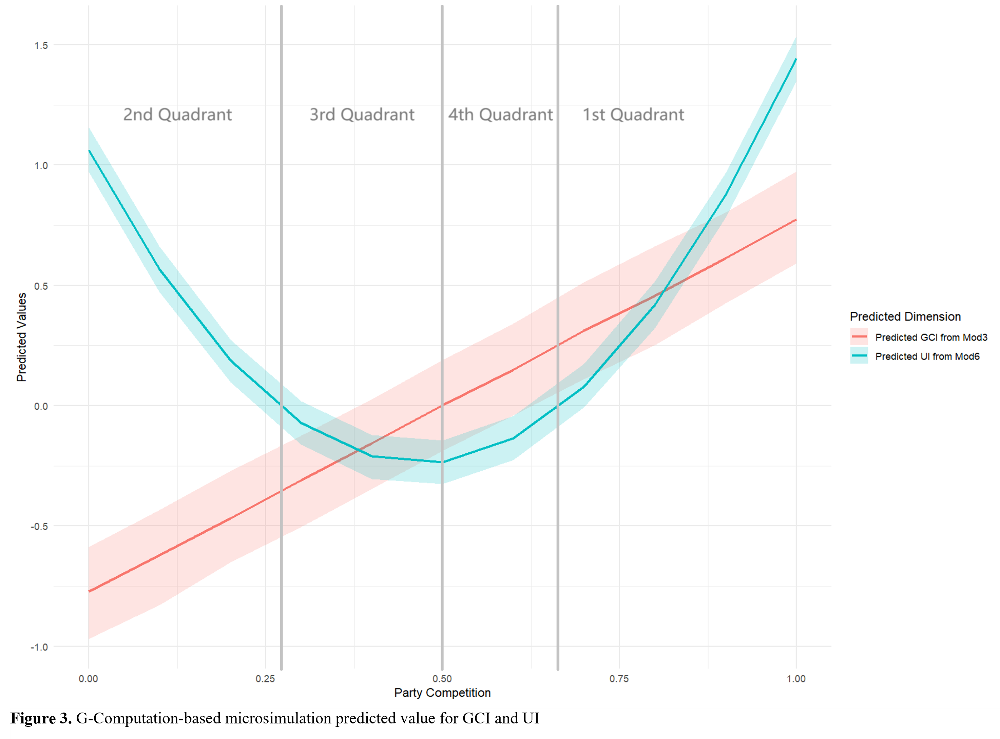

We utilize **Belief Network** approaches to conduct a cross-national comparison of different opinion polarization patterns. Following DellaPosta (2020), we come up with the 2-dimensional measure of polarization and link that with political factors of different countries using OLS and two-way fixed-effect (TWFE) models.

### Figure: Model-based Microsimulation Result

